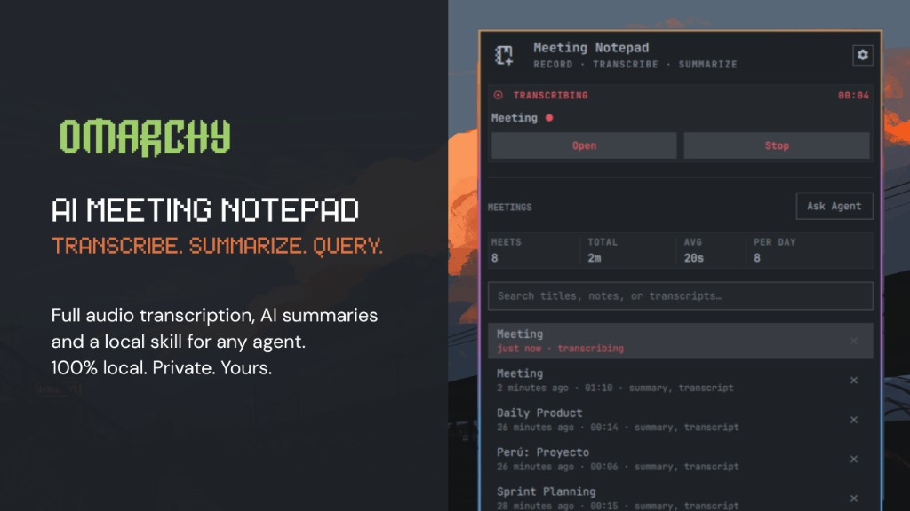
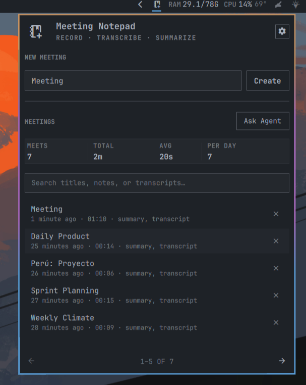
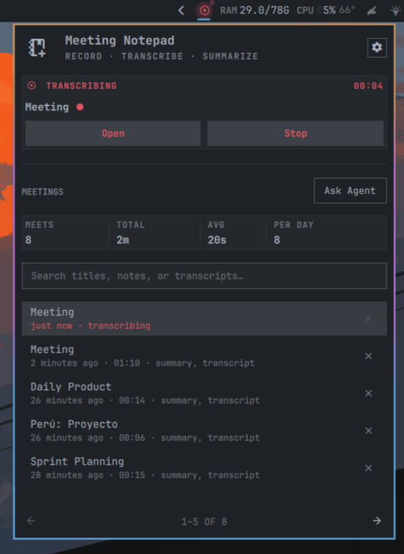
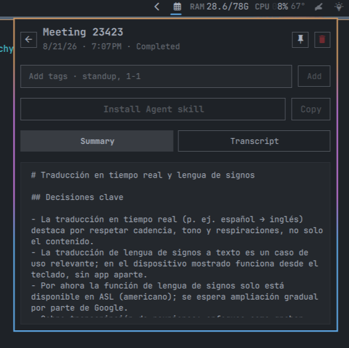

<div align="center">

# 📝 AI Meeting Notepad for Omarchy

> *"Granola-style notes — local, no meeting bot."*

**AI Meeting Notepad** for the **Omarchy** bar — capture desktop and microphone audio with [Voxtype](https://voxtype.io/),  
Markdown on disk, optional AI summary via your default Omarchy agent, and your own notes. Inspired by [Granola](https://www.granola.ai/).

<br>



</div>

## Install

```bash
omarchy plugin add https://github.com/jlopezxs/omarchy-ai-meeting-notes.git --enable
```

`--enable` puts it straight into the bar's right section. Without it, add it later via **Omarchy menu → Bar → Widgets**, or with:

```bash
omarchy plugin enable jlopezxs.meetings --section right
```

Or develop from a checkout:

```bash
rm -rf ~/.config/omarchy/plugins/jlopezxs.meetings
cp -r omarchy-meetings-notepad-ai ~/.config/omarchy/plugins/jlopezxs.meetings
omarchy plugin enable jlopezxs.meetings --section right
```

### Uninstall

`omarchy plugin remove` only deletes the plugin folder. It does **not** restore Voxtype or delete notes.

Run this first:

```bash
~/.config/omarchy/plugins/jlopezxs.meetings/uninstall.sh
omarchy plugin remove jlopezxs.meetings
```

That restores `~/.config/voxtype/config.toml` from the backup taken before this plugin changed it, asks Voxtype to reread config, removes copied agent skills, and deletes meeting notes under `~/.local/state/omarchy/meetings` plus onboarding state. A custom notes folder outside that path is left in place.

To keep notes:

```bash
~/.config/omarchy/plugins/jlopezxs.meetings/uninstall.sh --keep-notes
omarchy plugin remove jlopezxs.meetings
```

---

## ✨ Features


| | Feature | Description |
|:---:|:---|:---|
| 🎙️ | **Capture** | Desktop + microphone via [Voxtype](https://voxtype.io/) meeting mode — nothing joins the call |
| 📝 | **Transcript** | Whisper transcript saved when you stop the meeting |
| ✨ | **AI summary** | Optional. Off by default. When enabled, live and final summaries use your default Omarchy agent (that agent may send the transcript to a remote provider) |
| 📋 | **Your notes** | Manual notes auto-saved next to the transcript |
| 🔍 | **Search** | Find by title, notes, summary, or transcript |
| 📌 | **Float** | Pin the notepad as a picture-in-picture window on every workspace |
| 🤖 | **Agent skill** | `/omarchy-meeting-notepad` copied from the bundled skill so agents can read your notes |
| 💾 | **Markdown on disk** | One folder per meeting — capture and transcripts stay local |

---

## First launch

On first open, a **3-step onboarding** walks you through:

1. **What it does** — capture, transcribe, optional summarize, no meeting bot
2. **How it works** — Voxtype + PipeWire + Whisper + local Markdown; summaries only if you enable them
3. **Get set up** — **Install Voxtype** (opens the Omarchy installer) or **Get started** if already installed

Progress is saved to `~/.local/state/omarchy/meetings-onboarding.json`.

## Using it

**Search** past meetings by title, notes, summary, and transcript.

**New meeting** — enter a title, then Create meeting.

**Past meetings** — paginated list with relative time (`2 hours ago`) and duration. Tap a meeting to open the detail view.

While a meeting is active (draft or transcribing):

- **Start transcribing** on a meeting begins Voxtype transcription; **Stop** ends the meeting and saves the transcript (and an AI summary if you enabled that in Settings)
- **Your notes** auto-save below the controls
- Status shows **Transcribing · MM:SS**; the bar widget shows a duration badge
- Click the pin icon to **float** the notepad; **Dock** returns it to the bar panel

After you stop, the view switches to tabs: **Your notes** (once you have notes), **Summary**, and **Transcript**. The header has title, date/time, **Add notes**, and a **Copy** menu (plain text or Markdown).

## ⚙️ Settings

| Setting | Purpose |
|---------|---------|
| Notes folder | Where meetings are saved (default `~/.local/state/omarchy/meetings/`) |
| Meetings per page | How many meetings fit on each list page (default 5) |
| Default language | Whisper language (`auto`, `es`, `en`, …) |
| AI summaries | Off by default. When on, send the transcript to your default Omarchy agent for live and final summaries |
| Summary preprompt | Extra instructions prepended to the AI summary (only used when AI summaries are on) |
| Agent skill | Copy the bundled `/omarchy-meeting-notepad` skill into your agent skill folders |

## Files

```
<notes-root>/
  index.jsonl            # catalog for agents — one meeting per line
  YYYYMMDD_HHmmss_slug/
    meta.json            # title, ISO + unix times, speakers, stats
    transcript.jsonl     # one spoken turn per line (grep / cite this)
    transcript.md        # same content, human-readable
    notes.md             # your manual notes (optional)
    summary.md           # AI recap (not the search source)
    insights.json        # optional actions / topics / people
    chat.md              # Q&A history
    live-transcript.md   # while recording
```

## Agent skill (`/omarchy-meeting-notepad`)

The plugin ships a skill at `skills/omarchy-meeting-notepad/`. It tells any agent how the widget works, where notes live, and how to read them.

**From Settings:** open the notepad → gear → **Install for agents** (or **Already installed** to copy again). That copies the bundled skill into `~/.agents/skills`, `~/.claude/skills`, `~/.codex/skills`, and `~/.cursor/skills`. It does not download npm packages or fetch GitHub.

The skill lives at [`skills/omarchy-meeting-notepad`](https://github.com/jlopezxs/omarchy-ai-meeting-notes/tree/main/skills/omarchy-meeting-notepad) in the plugin repo.

[](https://skills.sh/jlopezxs/omarchy-ai-meeting-notes)

## Requirements

- Omarchy 4 (Quickshell shell)
- Voxtype with meeting mode
- Optional: a default Omarchy agent if you enable AI summaries (`omarchy default agent claude`)
- `wl-copy` for copy actions

## Validate

```bash
./tests/validate.sh
```

## IPC

```bash
omarchy-shell shell call jlopezxs.meetings toggleRecording
omarchy-shell shell call jlopezxs.meetings startRecording "Standup"
omarchy-shell shell call jlopezxs.meetings stopRecording
```

## Screenshots

| Meetings list | Transcribing | Detail view |
|:---:|:---:|:---:|
|  |  |  |

## Attribution

- Inspired by [Granola](https://www.granola.ai/) — local meeting notes, no bot in the call
- Capture and transcription via [Voxtype](https://voxtype.io/) meeting mode
- README intro style inspired by [One Dark Pro Darker](https://github.com/jlopezxs/omarchy-one-dark-pro-darker-theme)
